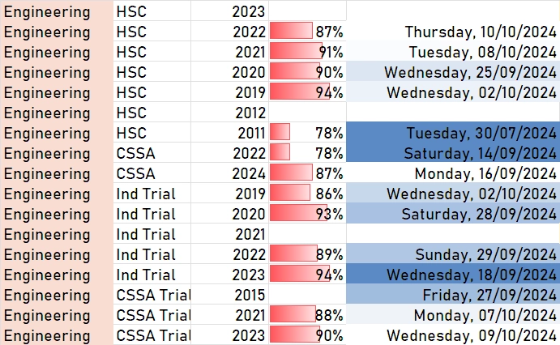

# エンジ ホームページ

> **engi homepage**
> 

no link sharing please :)

# [engineering textbook revision 01102024 (2)](https://www.notion.so/engineering-textbook-revision-01102024-2-cb17aa83cf654155bf4028801e318e28?pvs=21)

# [engineering paper revision 12102024 (1)](https://www.notion.so/engineering-paper-revision-12102024-1-bd9b0c6429364b908e3d4f8d978107dd?pvs=21)

# [anthony engi notes](https://www.notion.so/anthony-engi-notes-6e7120ecd9ab43adafd744a2bc3e10cb?pvs=21)

# [henry engi notes](https://www.notion.so/henry-engi-notes-32493bd35d444c6ab618037276a58f48?pvs=21)

# [shray engi notes](https://www.notion.so/shray-engi-notes-5dd15db34a134cd188a13343ff0e855b?pvs=21)

# [matthias engi notes](https://www.notion.so/matthias-engi-notes-925621b49820447ba1bf8224a6d94cb1?pvs=21)

paper difficulty guide

# dopierala posts

| Practice paper ANSWERS - 2024 CSSA Trial | [https://drive.google.com/file/d/1SZ8VuoXSG6K-IwD17JUSMR_N6oqJPbq5/view](https://drive.google.com/file/d/1SZ8VuoXSG6K-IwD17JUSMR_N6oqJPbq5/view) |
| --- | --- |
| HSC Course Summary | [https://docs.google.com/document/d/1JiJ6jNnIs-9XYiGDOEcF3wfB4hYWRe6soR-z3-1jZE4/edit](https://docs.google.com/document/d/1JiJ6jNnIs-9XYiGDOEcF3wfB4hYWRe6soR-z3-1jZE4/edit) |
| Engineering Studies - revision | [https://sites.google.com/education.nsw.gov.au/engineeringstudies/year-12-engineering-studies](https://sites.google.com/education.nsw.gov.au/engineeringstudies/year-12-engineering-studies) |
| Yr 12 Revision resources | [https://www.peterblakemaths.com/yr12-engineering-studies](https://www.peterblakemaths.com/yr12-engineering-studies) |
| HSC Multiple Choice Quiz | [https://quiz.nesa.nsw.edu.au/home](https://quiz.nesa.nsw.edu.au/home) |
| Mechanical Properties of Materials - Materials Science & Engineering | [https://www.youtube.com/watch?v=RHiwLpMYSEs](https://www.youtube.com/watch?v=RHiwLpMYSEs) |
| Using graphic solutions in exams | [https://drive.google.com/file/d/1UAxIwo2HJmNBRzbMuvC9Mde-6J4NUVBR/view](https://drive.google.com/file/d/1UAxIwo2HJmNBRzbMuvC9Mde-6J4NUVBR/view) |
| Materials | [https://mats1192.teaching.unsw.edu.au/](https://mats1192.teaching.unsw.edu.au/) |
| Practice paper ANSWERS - 2022 CSSA Trial | [https://drive.google.com/file/d/1-LTxFqTzPdJ4a9WeFcOsN5EXhxqcnrZh/view](https://drive.google.com/file/d/1-LTxFqTzPdJ4a9WeFcOsN5EXhxqcnrZh/view) |

---

---

[anthony engi notes](https://www.notion.so/anthony-engi-notes-6e7120ecd9ab43adafd744a2bc3e10cb?pvs=21)

[shray engi notes](https://www.notion.so/shray-engi-notes-5dd15db34a134cd188a13343ff0e855b?pvs=21)

[henry engi notes](https://www.notion.so/henry-engi-notes-32493bd35d444c6ab618037276a58f48?pvs=21)

[matthias engi notes](https://www.notion.so/matthias-engi-notes-925621b49820447ba1bf8224a6d94cb1?pvs=21)

[shopping](https://www.notion.so/shopping-5e1147c28b05439b8799b98770ef09ea?pvs=21)

[engineering textbook revision 01102024 (2)](https://www.notion.so/engineering-textbook-revision-01102024-2-cb17aa83cf654155bf4028801e318e28?pvs=21)

[engineering paper revision 12102024 (1)](https://www.notion.so/engineering-paper-revision-12102024-1-bd9b0c6429364b908e3d4f8d978107dd?pvs=21)